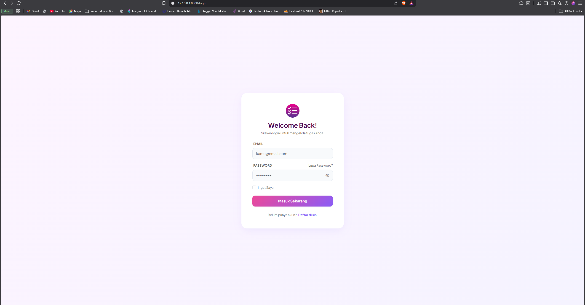
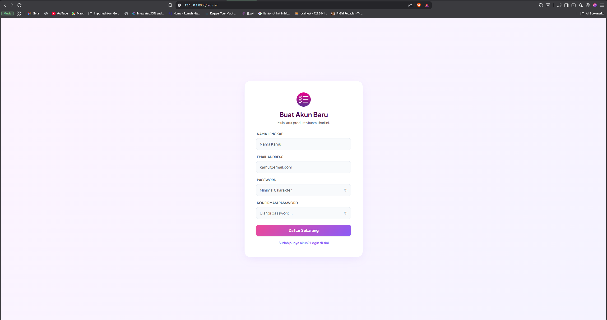
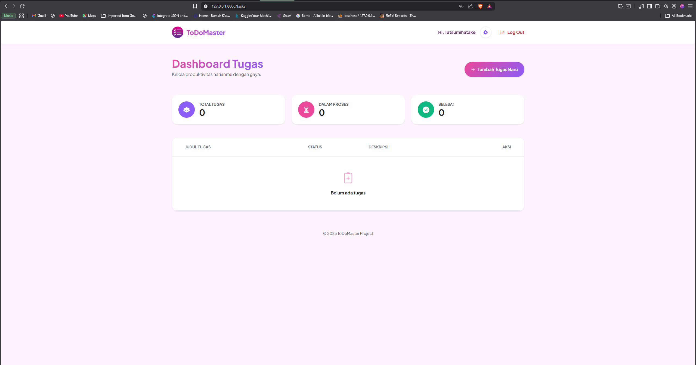
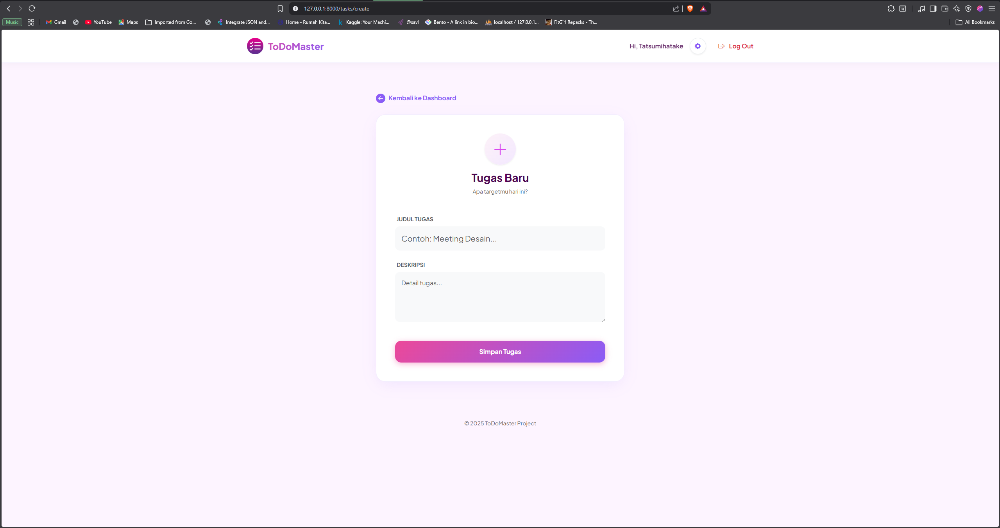
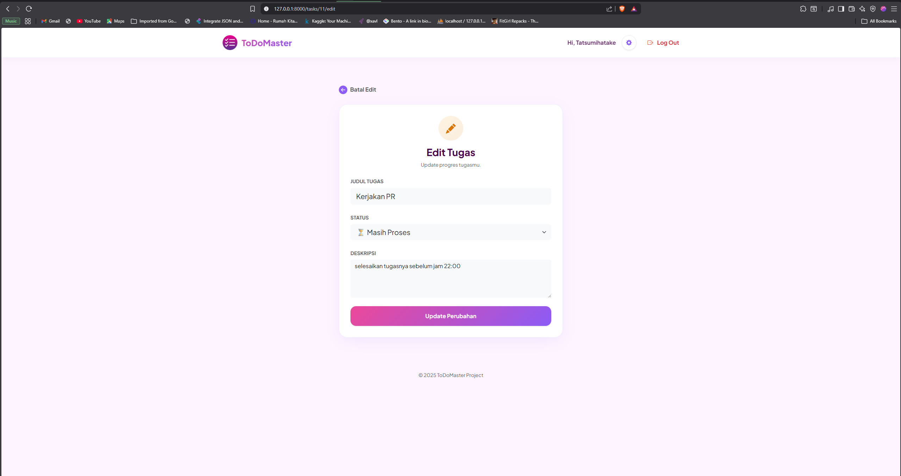
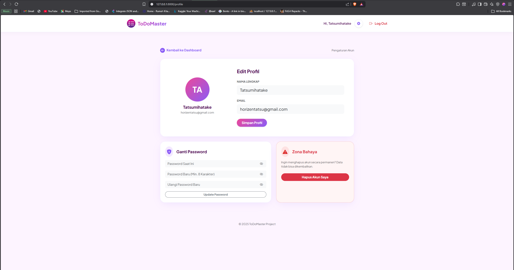
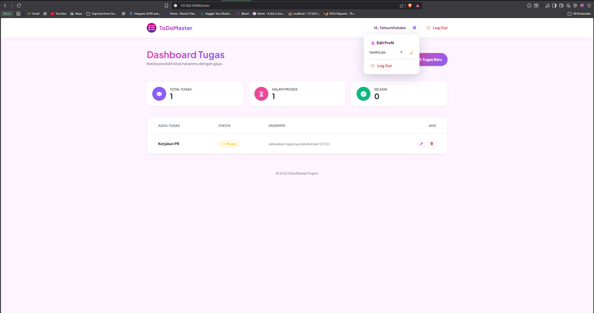

# 🚀 ToDoMaster - Next Gen Productivity App


**ToDoMaster** adalah aplikasi manajemen tugas berbasis web yang dirancang dengan pendekatan **UI Modern (Berry Gradient Theme)**. Aplikasi ini tidak hanya berfokus pada fungsi CRUD, tetapi juga menekankan pada *User Experience* (UX), keamanan data, dan estetika visual yang memanjakan mata.

Dibuat sebagai pemenuhan Tugas Responsi Pemrograman Web, proyek ini mengimplementasikan konsep MVC (Model-View-Controller) yang kokoh menggunakan framework Laravel.

---

## ✨ Fitur Unggulan (Key Features)

Aplikasi ini dilengkapi dengan fitur-fitur modern yang melampaui standar To-Do List biasa:

### 🎨 1. Berry Gradient Interface & Glassmorphism
Antarmuka pengguna didesain dengan palet warna gradasi *Pink-Purple* yang konsisten, dilengkapi efek *Glassmorphism* pada kartu dan modal, memberikan kesan aplikasi premium.

### 🔐 2. Advanced Security & Authentication
* **Secure Login/Register:** Sistem autentikasi bawaan Laravel yang telah dimodifikasi total tampilannya.
* **Password Visibility Toggle:** Fitur "Intip Password" (ikon mata) dengan posisi presisi untuk kenyamanan pengguna.
* **Live Validation:** Memberikan umpan balik instan saat pengguna salah memasukkan data.

### ⚡ 3. Interactive Task Management
* **Smart Dashboard:** Menampilkan statistik tugas (Total, Proses, Selesai) dengan kartu visual yang menarik.
* **Modal Confirmations:** Mencegah kesalahan hapus/edit dengan *Pop-up Modal* interaktif (bukan alert browser kaku).
* **CRUD Lengkap:** Tambah, Baca, Edit, dan Hapus tugas dengan alur yang mulus.

### 👤 4. Profile Control Center
Halaman pengaturan akun terpadu di mana pengguna dapat:
* Mengganti Nama & Email.
* Mengubah Password dengan validasi keamanan.
* Menghapus akun secara permanen (*Danger Zone*).

---

## 📸 Galeri Aplikasi (Showcase)

Berikut adalah tampilan antarmuka **ToDoMaster** yang telah selesai dikembangkan:

### 🔐 Autentikasi & Keamanan
Tampilan Login dan Register yang bersih dengan validasi real-time.

| Halaman Login | Halaman Register |
|:---:|:---:|
|  |  |

### 📊 Dashboard & Manajemen Tugas
Pusat kendali produktivitas dengan statistik visual.

| Dashboard Utama | Tambah Tugas Baru |
|:---:|:---:|
|  |  |

### 🛠️ Interaksi & Edit Data
Menggunakan Modal Pop-up untuk pengalaman pengguna yang lebih baik.

| Edit Tugas | Lupa Password |
|:---:|:---:|
|  |  |

### ⚙️ Pengaturan Profil
Manajemen akun pengguna yang lengkap dan aman.



*(Catatan: Fitur Dark Mode tersedia di menu pengaturan)*


---

## 💻 Panduan Instalasi (Local Setup)

Ingin menjalankan proyek ini di komputer lokal Anda? Ikuti langkah berikut:

1.  **Clone Repository**
    ```bash
    git clone [https://github.com/Tatsumihatake/todolist-app.git](https://github.com/Tatsumihatake/todolist-app.git)
    cd todolist-app
    ```

2.  **Install Dependencies**
    ```bash
    composer install
    npm install
    ```

3.  **Konfigurasi Environment**
    Duplikat file `.env.example` menjadi `.env`, lalu atur database:
    ```bash
    cp .env.example .env
    ```
    *Buka file .env dan sesuaikan `DB_DATABASE`, `DB_USERNAME`, dll.*

4.  **Generate Key & Migrate**
    ```bash
    php artisan key:generate
    php artisan migrate
    ```

5.  **Jalankan Server**
    ```bash
    npm run build
    php artisan serve
    ```
    Buka browser dan akses: `http://127.0.0.1:8000`

---

## 👨‍💻 Kredit Pengembang

Proyek ini dikembangkan dengan ❤️ oleh:

* **Nama:** Muhammad Ilham Wiradisastra
* **NIM:** 241111009
* **Kampus:** UBHINUS
* **Mata Kuliah:** Praktikum Pemrograman Web

---
*© 2025 ToDoMaster Project. All Rights Reserved.*